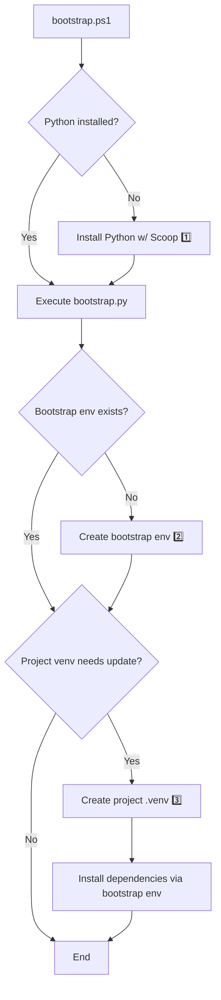

# Bootstrap

## Requirements

* [x] The powershell code shall be kept at minimum.
* [x] Usage of bootstrap: there shall be "one" liner of powershell to get the bootstrap script and start it.
* [x] Bootstrap shall be idempotent.
* [x] Bootstrap shall keep track of the dependencies and do incremental installs.
* [x] it should support both on-premise and public dependencies
  * [x] this means that bootstrap shall also work without internet connection, only intranet
* [x] the bootstrap shall create the virtual environment with the python version configured by the user
* [x] bootstrap shall run for users without administrative rights
* [x] bootstrap shall use semantic versioning
* [x] bootstrap shall have a configuration file for the user to define parameters like python version, python package manager, scoop installer, scoop python json base url

## Workflow

The bootstrap process is managed by two main scripts: a PowerShell script (`bootstrap.ps1`) for environment setup and a Python script (`bootstrap.py`) for dependency management.



1. This step will first install the `scoop` windows package manager and then call `scoop` to install the configured python version.
2. The bootstrap environment is created in the user's home directory (`~/.bootstrap/<hash>/`) and contains the package manager and pip-system-certs. The hash is computed from the Python version, package manager, and bootstrap packages configuration.
3. The project virtual environment is created by the package manager (Poetry or UV) running from the bootstrap environment.

### bootstrap.ps1

* Scoop configuration and installation
* Python version detection and installation
* Delegates to `bootstrap.py` for virtual environment setup

### bootstrap.py

* OS-agnostic virtual environment creation (Windows/Unix)
* **Two-step virtual environment management:**
  * **Bootstrap environment**: Shared cache in `~/.bootstrap/<hash>/` with package manager installed
  * **Project environment**: Project-specific `.venv/` with locked dependencies
* Smart caching with hash-based dependency tracking. Only runs if dependencies have been updated.
* Package manager support: Poetry, UV
* Automatic pip configuration for custom PyPI sources

## bootstrap.json Configuration

```json
{
    "python_version": "3.11",
    "python_package_manager": "poetry>=2.1.0",
    "bootstrap_packages": ["pip-system-certs>=4.0,<5.0"],
    "venv_install_command": "poetry install --no-interaction",
    "bootstrap_cache_dir": "~/.bootstrap",
    "scoop_ignore_scoopfile": true
}
```

| Option | Description | Default |
|--------|-------------|---------|
| `python_version` | Python version to use | System Python |
| `python_package_manager` | Package manager with version constraint | `poetry>=2.1.0` |
| `bootstrap_packages` | Packages to install in bootstrap environment | `["pip-system-certs>=4.0,<5.0"]` |
| `venv_install_command` | Custom command to install dependencies | Auto-generated based on package manager |
| `bootstrap_cache_dir` | Location for shared bootstrap environments | `~/.bootstrap` |
| `python_package_manager_args` | Extra arguments for package manager (legacy) | `[]` |

## Two-Step Virtual Environment Management

### Step 1: Bootstrap Environment (Shared Cache)

A bootstrap environment is created in the user's home directory at `~/.bootstrap/<hash>/` where the hash is computed from:

* Python major.minor version
* Package manager specification (e.g., `poetry==2.1.0`)
* Bootstrap packages list

This environment contains only the package manager and supporting packages (like `pip-system-certs`).

### Step 2: Project Environment

The project's `.venv/` is created by the package manager (Poetry or UV) running **from the bootstrap environment**. This means:

* The package manager is **not** installed in the project venv
* No dependency conflicts between package manager dependencies and project dependencies
* The bootstrap environment is **shared** across all projects with the same configuration

**Benefits:**

* ✅ No pip-installed package manager dependencies in project venv
* ✅ Shared cache reduces setup time for multiple projects
* ✅ Hash-based validation ensures environment consistency
* ✅ Atomic creation prevents corruption from concurrent runs

## Why do we need a bootstrap?

* scoop - package manager for Windows
  * we need it to install all tools a project needs
  * scoop is implemented in powershell
* powershell - available on all Windows machines
  * no batch
* python

**avengineers/bootstrap**

* install scoop - only if there is a scoopfile.json in the project
* install dependencies out of the scoop file json - only if there is a scoopfile.json in the project
* install package manager (poetry or uv) to create and manage virtual environments

Problem with the scoop install:

If you have the version of a tool already installed, the shims for that tool are not updated!
We need to have the shims updated because we need them to point to the version that we just want to install.

Bootstrap is using scoop import and not a scoop install.

Scoop import will not reset the shims:

```json
        {
            "Source": "sple",
            "Name": "mingw-winlibs-llvm-ucrt",
            "Version": "13.2.0-16.0.6-11.0.0-r1"
        },
```

There is a PR from Karsten to add a `--reset` option for import.

**pypackage-template/bootstrap**

* install scoop
* install python with the configured version (see bootstrap.json)
* start bootstrap.py
  * create bootstrap environment (shared cache with package manager)
  * create project venv
  * use bootstrap environment's package manager to install all dependencies in venv (based on pyproject.toml)

**Deploy bootstrap as an exe**

Disadvantages:

* installer is quite big
* installer might be slow if it needs to unpack the exe
* (!) the anti-virus software might mark it as a trojan (false positive)

Advantages:

* easy to install
* it can be a standalone python application using any python module

**Use case**

We want to use Python 3.12 in a project. What do I have to do?

* in the **pypackage-template/bootstrap** we need to update the bootstrap.json
* in the **avengineers/bootstrap** we need to update the scoopfile.json

**Use case**

Some colleagues do not have administrative rights and get Python installed by IT with admin rights.
The python path is added to the **system** PATH environment variable.
This means that the python from the system path will be found before the user path.

The problem is that build.ps1 calls `python.exe` in order to execute python scripts.
This means a different python version (3.12 instead of 3.10) might be use.

**Use case**

If I am in VS Code and the virtual environment is activated, VS code will run python in the background.
This means that cleaning and recreating the virtual environment will not work because VS Code keeps a handle on the python.exe.

One needs to close VS Code and run bootstrap again.

## Steps to be executed to build an SPL project on a fresh Windows machine

* install scoop to be able to install tools with scoop
* install tools with scoop (python included)
* install package manager (poetry or uv) to create a virtual environment
  * we need a virtual environment to install the dependencies of the project (SPL-Core needs python)
* run package manager to create the virtual environment and install dependencies
* run the build with the user defined targets

## Steps to be executed to build a Python package on a fresh Windows machine

* install scoop to be able to install tools with scoop
* install tools with scoop (python included)
* install package manager (poetry or uv) to create a virtual environment
  * we need a virtual environment to install the dependencies of the project (SPL-Core needs python)
* run package manager to create the virtual environment and install dependencies
* run tests
* build package
* publish package

## Design Decisions

* All Bootstrap functionality is implemented inside bootstrap.ps1 and bootstrap.py inside this repository.
* When we speak about Bootstrap we talk about these both files.
* Bootstrap is used by "other" repositories to install all external dependencies needed to start a build.
* Bootstrap is
  * either included in those other repositories (as "generated copy", not clone-and-own)
  * or fetched as external dependency (using git to clone/pull this repository)
    * This shall be a powershell one-liner (e.g. using "irm") usable, e.g., in build.ps1 of the "other" repository
* A repo using Bootstrap contains a bootstrap.json for configuration (might be generated or updated by generation)
